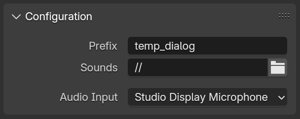

# Push To Talk

Convenient recording of scratch dialog for an edit in Blender's VSE.

## Usage

In the `Sequencer` header click `Start Recording` to capture your microphone's audio and click again to finish.

### Configuration

#### Audio files
Recordings are stored as WAV files called `temp_audio_...` next to the .blend file, with options to choose another location and name scheme.

#### Microphone
If there is more than one microphone available, a specific one can be selected in the recording configuration panel.
On Linux, it typically starts with `sysdefault` or `usb`.

## Installing

### Requirements
- **`ffmpeg`** (Windows and Linux). See [instructions for Windows](https://www.geeksforgeeks.org/how-to-install-ffmpeg-on-windows/).
- **`arecord`** (Linux only). On Arch you can install it via the `alsa-utils` package.

Note: macOS does not have additional requirements, as the add-on ships with a sound recording utility for that platform.

### Installing as Extension

This add-on is an extension, but it is not available on extensions.blender.org because it requires ffmpeg as a dependency.

1. Download the [latest extension release from github](https://github.com/britalmeida/push_to_talk/releases).
2. In Blender's `Edit > Preferences > Get Extensions`, click `v`, click `Install from Disk...` and select the ZIP.

### Installing as Legacy Add-on

1. Download the latest extension release or the repository as ZIP file.
2. In Blender's `Edit > Preferences > Add-ons`, click `Install` and select the ZIP.

#### Updating

1. Download the newest version ZIP.
2. In Blender's `Edit > Preferences > Add-ons`, find this add-on, expand it, and click `Remove`.
3. Click `Install` and select the ZIP.

### Compatibility

| Blender Version    | Status      |
|--------------------|-------------|
| 4.3, 4.4, 4.5      | Supported   |
| 4.2 LTS            | Supported   |
| 3.6 LTS            | Supported   |
| 3.3 LTS            | Supported   |
| 2.93 LTS and older | Unsupported |
